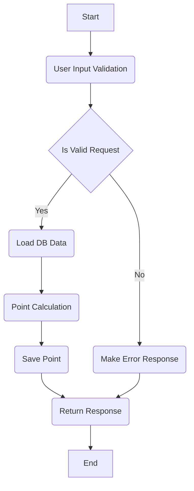

```mermaid
flowchart
    A[Start] --> B(User Input Validation)
    B --> C{Is Valid Request}
    C -->|Yes| D(Load DB Data)
    C -->|No| E(Make Error Response)
    D --> F(Point Calculation)
    F --> G(Save Point)
    G --> H(Return Response)
    E --> H
    H --> J[End]
```
